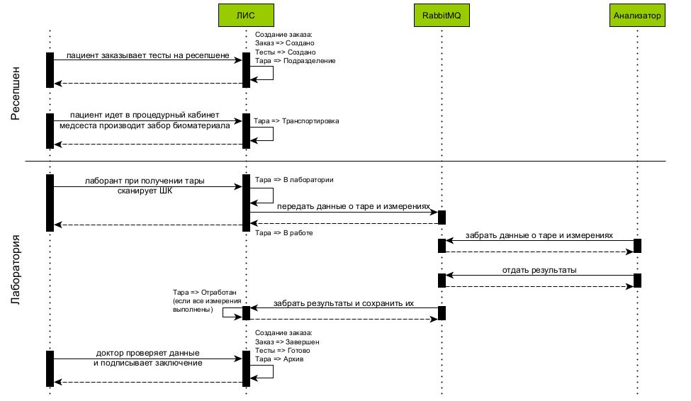
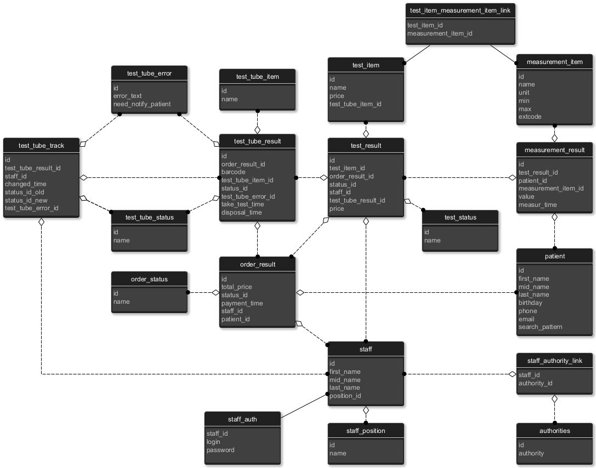

Чувенкова Татьяна
Группа 2025-01-spring

## Проектная работа "Прототип лабораторной информационной системы (ЛИС)"
Исследование биоматериала проводят на автоматических, полуавтоматических анализаторах и с помощью «ручных» методик. Данный прототип рассчитан только на работу с автоматическими анализаторами.

Состоит из двух модулей:
1. Лаборатория;
2. Адаптер анализатора.

### Модуль "Лаборатория"
Обеспечивает работу следующих рабочих мест:
1. Ресепшен:

    1.1 создание и поиск пациента по ФИО;

    1.2 просмотр прайс-листа;

    1.3 оформление заказа в лабораторию;

    1.4 просмотр журнала заказов по разным параметрам (время, статус, пациент).

2. Кабинет медсестры:

    2.1 просмотр заказов, для которых необходимо взять биоматериал;

    2.2 подтверждение о заборе биоматериала.

3. Лаборатория. Лаборант:

    3.1 подтверждение прибития тары в лабораторию;

    3.2 просмотр журнала тары;

    3.3 указание для тары проблемы, возникающей в процессе исследования содержимого;

    3.4 отправка данных тары в анализатор для исследования через RabbitMQ.

4. Лаборатория. Доктор:

    4.1 просмотр журнала тары и тестов, которые нужно проверить и подтвердить;

    4.2 просмотр динамики изменения конкретного пациента;

    4.3 возможность отправить тару на повторный анализ из-за некорректных результатов.

### Модуль "Адаптер анализатора"
Приннимает из RabbitMQ данные о таре и измерениях, которые нужно получить при анализе. Результаты отправляет обратно так же через RabbitMQ.

### Взаимодействие между модулями

### Схема базы данных
ORDER – заказ в лабораторию.

TEST_TUBE – тара (пробирка/контейнер).

TEST – анализ.

MEASUREMENT – измерение.

Статуы заказа: Создан, В работе, Завершен, Отменен.

Статусы теста: Создан, В работе, Готово, Отменен.

Статусы тары: Подразделение, Транспортировка, В лаборатории, В работе, Отработан, Архив, Утилизировано, Ошибка.

***

### Использование прототипа
Для работы в систему добавлено несколько пользователей с определенными правами доступа:
1. Сотрудник ресепшена - логин cos. Права доступа - LABORATORY. Все запросы, кроме специфическихЮ присущих конкретному рабочему месту.

2. Медсестра - LABORATORY, NURSE. Дополнительно забирает биоматериал и готовит к транспортировке.

3. Лаборант - labass. Права доступа - LABORATORY, LAB_ASSISTANT. Дополнительно регистрирует тару в лаборатории и отправляет данные в анализатор.

4. Врач - doc. Права доступа - LABORATORY, DOCTOR. Дополнительно подписывает заключение.

#### Запросы 
1. Сотрудник перед началом работы должен пройти аутентификацию в системе

POST http://localhost:8080/login HTTP/1.1
Content-Type: application/json

{
    "login": "cons",
    "password": "123"
}

2. Ресепшен. Создание пациента

POST http://localhost:8080/api/patient HTTP/1.1
Content-Type: application/json
Authorization: Bearer token

{
    "firstName": "name",
    "middleName": "midName",
    "lastName": "lastName",
    "birthday": "1111-11-11",
    "phone" : "+7(000)-00-000-00"
}

3. Ресепшен. Список тестов, которые можно добавить в заказ

GET http://localhost:8080/api/testItem HTTP/1.1

4. Ресепшен. Создание заказа

POST http://localhost:8080/api/order HTTP/1.1
Authorization: Bearer token
Content-Type: application/json

{
    "patientId": 100,
    "staffId": 2,
    "testItemIdList" : [1, 3]
}

5. Процедурный кабинет. Просмотр списка заказов, для которых нужно взять биоматериал

GET http://localhost:8080/api/nurse/order HTTP/1.1
Authorization: Bearer token

6. Процедурный кабинет. Просмотр конкретного заказа

GET http://localhost:8080/api/nurse/order/100 HTTP/1.1
Authorization: Bearer token

7. Процедурный кабинет. Подверждение о заборе биоматериала для заказа

PUT http://localhost:8080/api/nurse/order/100 HTTP/1.1
Authorization: Bearer token

8. Лаборант. При получении тары в лаборатории сканируем ШК тары и обновляем статусы

PUT http://localhost:8080/api/labAss/testTubeResult/0000000100 HTTP/1.1
Authorization: Bearer token

9. Лаборатория. Посмотреть информацию о таре (с треком) 

GET http://localhost:8080/api/testTubeResult/barcode/0000000100  HTTP/1.1
Authorization: Bearer token

10. Лаборатория. Список всех ошибок при работе с тарой

GET http://localhost:8080/api/testTubeError HTTP/1.1
Authorization: Bearer token

11. Лаборатория. Обновить ошибку для тары

PUT http://localhost:8080/api/testTubeResult/error HTTP/1.1
Content-Type: application/json
Authorization: Bearer token

{
    "id": 100,
    "errorId": 11
}

Если ошибку исправили

PUT http://localhost:8080/api/testTubeResult/error HTTP/1.1
Content-Type: application/json
Authorization: Bearer token

{
    "id": 100,
    "errorId": null
}

12. Лаборатория. Журналы для поиска тары

* по дате забора и статусу

GET http://localhost:8080/api/testTubeResult/time/2025-07-24/status/2 HTTP/1.1
Authorization: Bearer token

* по статусу

GET http://localhost:8080/api/testTubeResult/status/4 HTTP/1.1
Authorization: Bearer token

13. Лаборатория. Вывести список измерений 

* по ШК

GET http://localhost:8080/api/measurementResult/testTubeResult/0000000100 HTTP/1.1
Authorization: Bearer token

* по заказу

GET http://localhost:8080/api/measurementResult/order/100 HTTP/1.1
Authorization: Bearer token

14. Лаборатория. Динамика измерений пациента

GET http://localhost:8080/api/measurementResult/patient/100/measurementItemId/26 HTTP/1.1
Authorization: Bearer token

15. Доктор. Подписание заключения

PUT http://localhost:8080/api/doctor/order/barcode/0000000100 HTTP/1.1
Authorization: Bearer token

16. Список заказов пациента

GET http://localhost:8080/api/order/patient/100 HTTP/1.1
Authorization: Bearer token
